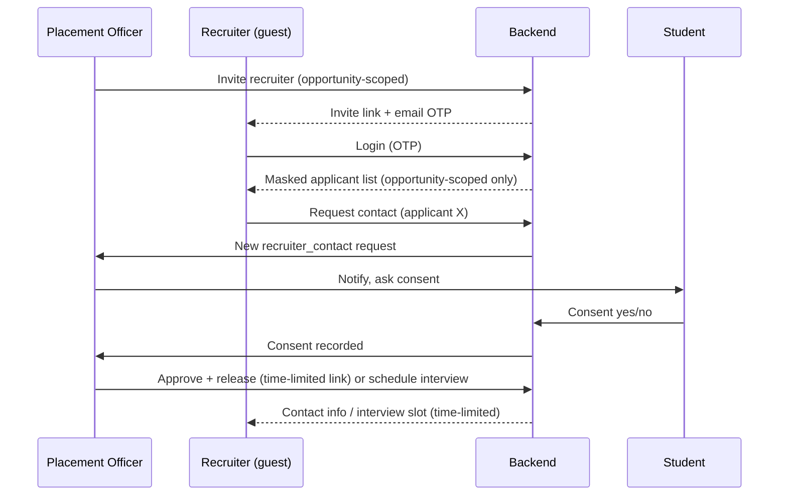

# ARCHITECTURE — BPUT Campus Super-App

## 1. Stack summary

| Layer | Choice | Notes |
|---|---|---|
| Frontend | React + Vite, Tailwind CSS, Workbox (PWA) | `vite-plugin-pwa`, `react-i18next`, TanStack Query, Dexie |
| Backend | NestJS (single service for prototype) | FastAPI added only when real ML lands (post-hackathon) |
| Database | PostgreSQL | one schema, `college_id` on every tenant-scoped table |
| Cache/Queue | Redis + BullMQ | rate limiting, SLA timers, digest jobs |
| Object storage | MinIO (S3-compatible) | complaint photos, certificates, resumes |
| Auth | JWT (access + refresh) + argon2id + TOTP (staff/admin) + email-OTP (recruiters, password reset) | WebAuthn deferred |
| Offline sync | Dexie (IndexedDB) + idempotent sync queue | not CRDT — see §4 |
| Hosting | Docker Compose → Render/Railway | Kubernetes deferred |
| Monitoring | Sentry + a `/health` endpoint | Grafana/Prometheus deferred |

## 2. High-level system diagram

```mermaid
flowchart LR
    subgraph Client
      PWA[React PWA\n(student/faculty/admin)]
      SMSsim[SMS Simulator\n(demo only)]
    end

    subgraph Backend[NestJS API]
      Auth[Auth & Guards]
      ReqEngine[Request Engine\n(leave, complaint, contact-request)]
      Attend[Attendance]
      Notice[Notices]
      Placement[Opportunities & Recruiter View]
    end

    PWA -- JWT --> Auth
    SMSsim -- channel=sms --> ReqEngine
    PWA --> ReqEngine
    PWA --> Attend
    PWA --> Notice
    PWA --> Placement

    Auth --> DB[(PostgreSQL)]
    ReqEngine --> DB
    Attend --> DB
    Notice --> DB
    Placement --> DB

    ReqEngine --> Queue[(Redis / BullMQ)]
    Notice --> Queue
    Placement --> Storage[(MinIO)]
    Attend --> Storage
```

## 3. Multi-tenancy: `college_id`

Every domain table (`users`, `attendance_sessions`, `requests`, `complaints`, `notices`, `opportunities`, `achievements`, …) carries a `college_id` foreign key. This is enforced two ways:

1. **Application layer** — every query is built from the authenticated user's `college_id`; no endpoint accepts a client-supplied `college_id`.
2. **Defense in depth (stretch goal)** — PostgreSQL Row-Level Security policy keyed on `college_id`, so even a bug in a service can't leak across colleges.

The demo seeds one college, but no query anywhere is written "for one college" — this is a day-one constraint, not a later migration.

## 4. Offline sync (attendance)

**Decision: Dexie + idempotent queue, not Yjs/CRDT.** Attendance is a single record per `(session_id, student_id)` — there's no concurrent free-text editing that CRDTs solve for. A CRDT here would add real complexity for no benefit.

Flow:
1. Faculty opens today's session (prefetched from the timetable, cached in Dexie).
2. Marks present/absent per student — writes go to a local Dexie table with a client-generated UUID and a `synced: false` flag.
3. On reconnect, a background sync worker POSTs unsynced records to `/attendance/sync`.
4. Server upserts on `(session_id, student_id)` — same UUID replayed twice is a no-op (idempotent). Server also checks the posting user is the teacher assigned to that session, within the edit window (see RULES.md).
5. On success, Dexie rows are marked `synced: true`; on logout, all local attendance data is cleared (shared-device hygiene).

## 5. The request engine (core architectural bet)

Leave, gate-pass, complaints, and the new **recruiter contact-request** are all instances of one generic engine:

```
Request {
  id, college_id, type            // "leave" | "gate_pass" | "complaint" | "recruiter_contact"
  requester_id, subject_id?        // subject_id = the student a recruiter is requesting, when applicable
  channel                          // "app" | "sms" | "email"
  state                            // draft -> pending -> approved|rejected -> (closed)
  approver_chain                   // resolved per type + context, e.g. duration-based for leave
  sla_deadline, created_at, ...
}
```

- **Channel-agnostic**: the SMS simulator posts to the same `/requests` endpoint with `channel=sms`; the parser just turns `LEAVE 2 FEVER` into the same payload the app would send. This is the one thing worth over-engineering slightly, because it's the headline architectural claim.
- **Approver chain is config, not code**: leave routes by duration, complaints route by category → assignee → escalation chain, recruiter-contact routes to the placement officer. Adding gate-pass or, later, fee-query requests should mean adding a config row, not a new controller.
- Each request type may define **extra required fields** (e.g., recruiter_contact requires `opportunity_id` + `student_consent: pending`).

## 6. Recruiter guest view — data flow



Key architectural point: masking is done by a **separate recruiter-facing serializer/view** on the backend — never a frontend-only filter. The recruiter's API responses structurally cannot contain hidden fields (name, contact, resume URL) unless the request has been approved and released for that specific applicant.

## 7. i18n architecture

- `react-i18next`, one JSON file per locale (`en.json`, `hi.json`, `or.json`), all UI strings are keys — no hardcoded strings in components.
- Fonts: Noto Sans Devanagari, Noto Sans Oriya, self-hosted and precached by the service worker (Google Fonts CDN won't load offline).
- Backend never returns language-specific prose — only error **codes**; the frontend maps codes to translated messages. This means adding a language later is a frontend-only JSON addition.
- User-submitted content (notices, complaints) is not auto-translated; optional Hindi/Odia fields are offered on submission forms. Machine translation (e.g., Bhashini, IndicTrans2) is a post-hackathon enhancement.

## 8. Notifications architecture

Adapter pattern: `NotificationChannel` interface with `EmailChannel` (real, Nodemailer/Mailtrap), `InAppChannel` (real), and `SmsChannel`/`WhatsAppChannel` (mock providers that render to a simulated phone screen in the demo UI — real gateways need DLT-approved templates in India and are a post-hackathon integration, e.g. MSG91).

## 9. File storage & certificate verification

- MinIO buckets per artifact type (`complaints/`, `resumes/`, `certificates/`), accessed only via short-lived presigned URLs, permission-checked per file.
- Certificate verification: on issue, compute SHA-256 of the certificate file, store the hash + a public verify page at `/verify/:hash` (no login required) that confirms authenticity without exposing the file itself.
- Achievements/badging (future): `achievements` table stores `evidence_file_ref`, `status` (`pending`/`verified`/`rejected`), `verified_by`, `verified_at` — built now so badging is a layer on top later, not a rebuild.

## 10. Deployment

Single `docker-compose.yml`: `api` (NestJS), `web` (static PWA build served via Nginx or same container), `postgres`, `redis`, `minio`. Deployed to Render/Railway for the demo. Environment-specific secrets via `.env`, never committed (see RULES.md).
